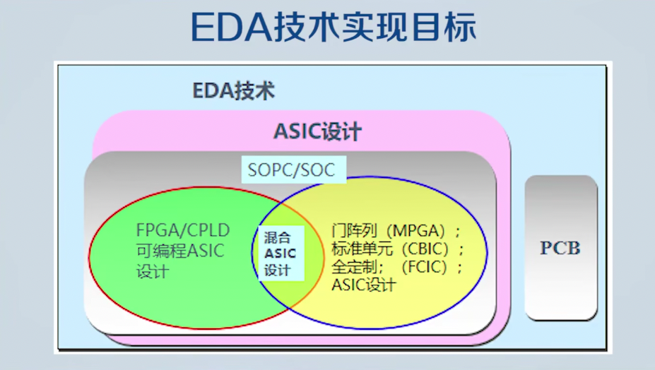
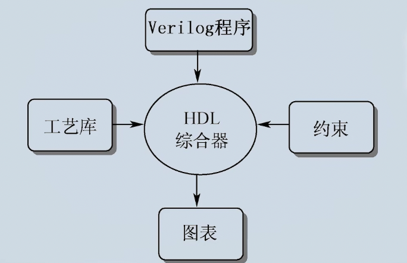
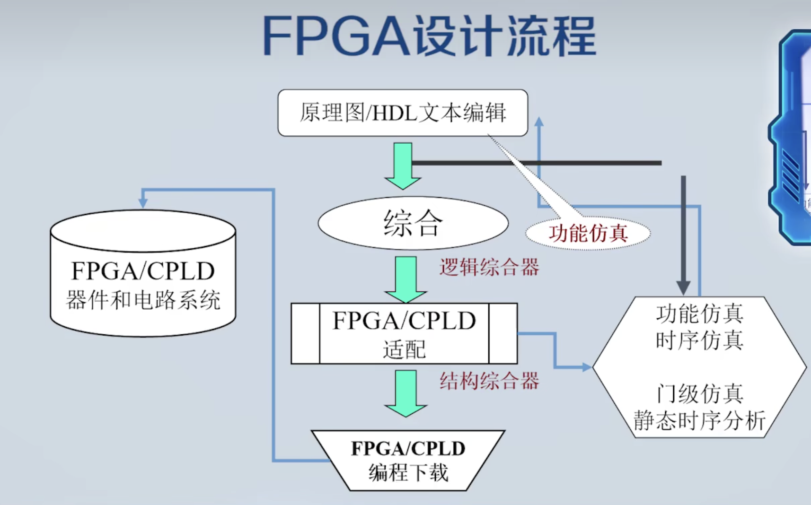

# EDA Tutorial

## 1. 什么是EDA

EDA: Electronic Design Automation（电子设计自动化）

* 百度百科：EDA技术就是以计算机为工具，设计者在EDA软件平台上，用硬件描述语言VerilgHDL完成设计文件，然后由计算机自动地完成逻辑编译、化简、分割、综合、优化、布局、布线和仿真，直至对于特定目标芯片的适配编译、逻辑映射和编程下载等工作。DEA技术的出现，极大的提高了电路设计的效率和可操作性。

### EDA的目标：

* IC设计制造
* FPGA/CPLD应用
* PCB（印制电路板）设计

### EDA技术发展历程：

CAD(计算机辅助设计) ---> CAE(计算机辅助工程) ---> EDA(电子设计自动化) ---> ESDA？

CAD：图纸的绘制在计算机上完成，电路模拟在计算机上完成。

CAE（上个世纪七八十年代）：在现有的电路版图基础上，计算机帮助完成布局布线。

EDA（九十年代）：代替手工设计SOC芯片，由人写出HDL语言，电脑进行转换。

ESDA：S指的是系统。

### EDA技术实现目标




### FPGA/CPLD/ASIC是什么

FPGA：Field Progrmmable Gate Array（现场可编程门阵列）

CPLD：Complex Programmable Logic Device（复杂可编程逻辑器件）

CPLD因为容量较小，逐渐退出市场。

ASIC：Application Specific Integrated Circuit（专用集成电路）

ASIC现在泛指所有集成电路，有时候集成电路设计也被称为ASIC设计


## 2. HDL简介

HDL: Hardware Description Language（硬件描述语言）

### 常见的HDL语言

1. VHDL
2. Verilog HDL
3. SystemVerilog
4. System C

其中前两个在EDA设计中使用最多，也得到几乎所有主流EDA工具的支持（IEEE标准）；后两种语言还在完善过程中，主要加强了系统验证方面的功能

SystemVerilog继承了Verilog的语法，并进行了扩展。

 ### Verilog例子：

（32位二进制计数器）纯文本描述方式

````verilog
module cnt32
(
  input clk,
  output reg[31:]q
);
  
  always @(posedge clk)
    q = q + 1'b1;
endmodule
````

### Verilog发展历史

* Verilog HDL(简称Verilog)
* 1983年，由GDA创建，用作Verilog-XL仿真器的内部语言(只用作内部脚本类型的语言)
* 1989年GDA被Cadence公司收购，Verilog成为Cadence公司的私有财产
* 1990年，Cadence公司决定并成立了OVI( Open Verilog International )组织，公开Verilog语言，并由OVI负责促进Verilog语言发展
* 偏向于C语言
* 在OVI的努力下，1995年，IEEE制定了Verilog的第一个国际标准，也就是Verilog 1.0
* 2001年，IEEE发布了Verilog第二个版本2.0，也称为Verilog-2001

于VHDL相比：

* VHDL优势：语法更严谨，通过EDA工具自动语法检查，排除许多设计中的疏忽
* VHDL缺点：代码冗长；对数据类型匹配要求过于严格；对版图级、管子级这些较为底层的描述级别几乎不支持，无法直接作集成电路底层建模

## 3. 设计层次于综合

### 电路描述层次级别

* 系统级（ESL）
  * 最上层，最高级
* 行为级
  * 描述电路的行为；比如计数器对行为就是每个时钟进行+1的操作
* RTL级（寄存器传输级）
  * 偏向于电路的具体实现
  * 于门级相比抽象很多；不考虑加法器怎么去实现...
* 门级
  * 与门，非门...
* 管子级（MOS级别）
  * 
* 物理级


上图中，左侧是门级，中间是管子级，右侧是物理级（版图）

### HDL综合

HDL综合：把HDL描述转换为门级电路描述。

#### Systhesis（综合）：

字面意思：通过组合某些模块，把设计抽象层次中的一种表示转换为另一种表示的过程

EDA中的综合：将用行为和功能层表达的电子系统转换为底层次的便于具体实现的模块的组合的过程

#### 编译器和综合器功能对比

* 对于软件语言设计目标流程：
  * C（程序） ---> 软件程序编译器（Compiler) ---> CPU指令/数据代码：010010 ....
* 硬件语言设计目标流程：
  *  Verilog/VHDL程序 ---> 硬件描述语言综合器(SYNTHESIZER) ---> 为ASIC设计提供的电路网表文件

#### 综合

设计过程中的每一步都可以称为一个综合环节。

* 从自然语言到VHDL语言算法表示，即自然语言综合；
* 从算法表示转换到寄存器传输级（RTL），即从行为域到结构域到综合，即行为综合；
* RTL级表示转换到逻辑门（包括触发器）的表示，即逻辑综合；
* 从逻辑门表示转换到版图表示（ASIC设计），或转换到FPGA的配置网表文件，可称为版图综合或者结构综合。有了版图信息就可以把芯片生产出来了。有了对应的配置文件，就可以使对应的FPGA变成具有专门功能的电路器件。



## 4. FPGA设计流程



* 首先是原理图/HDL文本编辑。目前推荐HDL文本形式编辑，而不是原理图。（设计出来的偏向于语言级，抽象的）
* 做完设计输入到软件当中，进行综合操作（经过综合后生成门级网表）
* FPGA/CPLD适配（物理综合）将门级网表转换为FPGA内部可编程单元进行配置的东西，生成一个可以下载的文件，直接下载到FPGA，就可以在硬件层面重现之前写的功能。
* 关于仿真：
  * 完成语言描述之后应该进行功能仿真（所有的电路延时都会被设为0，所以跟实际情况不符，但是可以检测逻辑是否正确）。但是由于一些性能只有在适配之后才能体现出，所以会在适配后再仿真（再仿真的时候除了功能仿真会加上时序仿真，时序仿真会把延时问题暴露出来）。
  * 时序仿真只能在综合之后才能仿真。
  * 门级仿真在适配之前做没有意义，因为无法将延迟问题涵盖进来。

### 设计输入（原理图/HDL文本编辑）

1. 图形输入

   1. 原理图输入
   2. 状态图输入
   3. 波形图输入

   所有的图形输入无法把规模做的很大

2. HDL文本输入

   * 这种方式与传统的计算机软件语言编程输入基本一致。就是将使用了某种硬件描述语言的电路设计文本，如VHDL或者Verilog的源程序，进行编辑输入。
   * 可以说，应用HDL的文本输入方法克服了上述原理图输入法存在的所有弊端，为EDA技术的应该和发展打开了一个广阔的天地。

例子：


### 综合

通过软件，将文本编辑的语言文件转换为门级网表文件。

### 适配

将综合器产生的网表文件配置于指定的目标器件中，使之产生最终的下载文件。

### 仿真

时序仿真：

* 就是接近真实器件运行特征的仿真，仿真文件中已经包含了器件硬件特性参数，因而，仿真精度高。

功能仿真：

* 是直接对VHDL、原理图描述或者其他描述形式的逻辑功能进行测试模拟，以了解其实现的功能是否满足原设计的要求的过程，仿真过程中不涉及任何具体期间的硬件特性。

静态时序分析：

* 因为生成门级网表后，他们需要经过的门和路径都已经确定，可以通过数学方法计算出所经过路径产生的延时。

### 编程下载

通常，将对CPLD的下载称为编程，对FPGA中SRAM进行直接下载的方式称为配置，但对于OTP FPGA的下载和对FPGA的专用配置ROM的下载仍称为编程。

### 硬件测试

最后是将含有已经载入了设计的FPGA或CPLD的硬件系统进行统一测试，以便最终验证设计项目在目标系统上的实际工作情况，以排除错误，改进设计。
